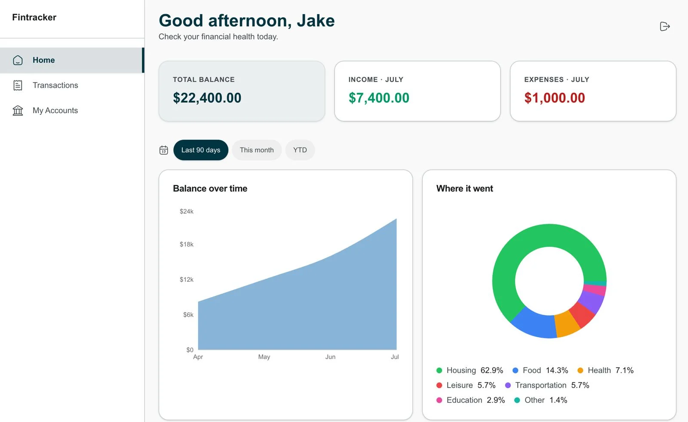

# FinTracker
 
Personal finance tracker — accounts, transactions, transfers, and cash flow insights.
 
**[Live demo](https://fintracker.gsoldateli.dev)**
 

 
Built with Next.js 16 (App Router), TypeScript, Drizzle ORM, Turso/libSQL, Zod, shadcn/ui, Vitest, GitHub Actions and Vercel.
 
---
 
## What it does
 
Multiple accounts with balances derived from every transaction. Income and expense entries with filters, search and cursor-based pagination. Transfers between accounts as a single atomic operation. Dashboard with balance over time and spending by category. User-owned categories, creatable inline while logging a transaction.
 
---
 
## Architecture decisions
 
The decisions below were made deliberately, with alternatives considered. Each one includes the trade-off accepted.
 
**Money is an integer number of cents — never a float.** The sign carries meaning: expenses are stored negative, income positive, and a transfer is a `-X` / `+X` pair. Normalization happens in one place (`transactions/service.ts`), so the caller always passes a positive amount and the domain applies the sign. *Trade-off:* every display path must format cents; in exchange, balance is a plain `SUM` and floating-point drift is impossible.
 
**Account balance is derived, never stored.** There is no `balance` column. Balance is `COALESCE(SUM(amount_cents), 0)` over the account's transactions (`accounts/queries.ts`). *Alternative rejected:* a materialized column updated on write — faster to read, but it introduces drift the moment any write path forgets to update it. A snapshot/checkpoint pattern would address the performance concern, but at this scale it would be optimizing a problem that doesn't exist yet.
 
**A transfer is two rows, not one.** Each transfer writes a debit and a credit inside a single `db.transaction()`, linked by a `transferGroupId` (`accounts/service.ts`). *Alternative rejected:* one row with `fromId`/`toId`, which is simpler to write but makes "all movements on this account" a query with two conditions instead of one, and complicates balance derivation. Transfers are excluded from cash flow aggregations — they are internal movement, neither income nor expense — and collapse to a single row in listings.
 
**The initial balance is a transaction, not a column.** Creating an account with a starting balance writes an `initial_balance` transaction atomically with the account (`accounts/service.ts`). It counts toward total balance but is excluded from income/expense aggregations. *Why:* it keeps balance a pure sum of transactions, with no special case.
 
**Dates have two natures, stored differently.** A transaction's `date` is the day the user picked — a **civil date**, stored as a `"YYYY-MM-DD"` string with no timezone, because June 3rd is June 3rd anywhere. `createdAt` is an **instant**, stored as a UTC timestamp. Conflating them is the classic off-by-one-day bug: `new Date("2026-06-03")` is UTC midnight, which is June 2nd in any negative offset. Civil dates never pass through `Date` in the normal path (`lib/date.ts`), and lexicographic comparison of `YYYY-MM-DD` is chronological, so ordering and cursors work on the string directly.
 
**Keyset (cursor) pagination, not `OFFSET`.** The cursor is a composite of `(date, createdAt, id)` (`transactions/queries.ts`), with overfetch-and-pop to detect whether more pages exist. *Why not offset:* offset paginates by position, so a row inserted at the top shifts every subsequent page — items get skipped or duplicated. Cursor paginates by value and is stable under insertion. The composite matters: two transactions on the same day would break a date-only cursor, and since IDs are UUIDs (not sequential), `createdAt` provides the meaningful tiebreak before the UUID acts as the final guarantee of a total order.
 
**Turso (libSQL) over Postgres.** Turso is SQLite-compatible — a ground-up rewrite in Rust that keeps the SQL dialect and file format while adding a network layer and a free tier that costs nothing at this scale. Chosen for cost and operational simplicity: no server to run. *Trade-off:* writes are still serialized on Turso Cloud today (MVCC-based concurrent writes exist in the engine but aren't generally available yet), and the ecosystem is far smaller than Postgres. Neither constrains an app where each user writes a handful of transactions a day — but both would at higher write concurrency. Drizzle's dialect abstraction keeps the migration path open.
 
**Feature-based structure, not technical layers.** `src/features/<feature>/` holds `components/`, `service.ts`, `queries.ts`, `schemas.ts` and `actions.ts` together. Everything needed to change one feature lives in one folder. *Trade-off:* some duplication across features, versus the constant navigation cost of layer-based structure.
 
**No Repository Pattern.** Drizzle is already the abstraction over SQL, and it's typed. Wrapping it in repositories would add indirection whose only justification — swapping the database — isn't a real requirement here.
 
**Dependency injection without a framework.** Services take the database as their first parameter (`accounts/service.ts`). No container, no decorators. This is what makes integration tests possible against a real database: the test passes its own connection. `getDb()` is called only by Server Actions, never by services.
 
**`Result<T, E>` for domain errors, exceptions for infrastructure.** Business failures — insufficient funds, category type mismatch, account not found — are values in the type system, and the compiler forces the caller to handle them. Exceptions are reserved for things that shouldn't happen: a missing `SESSION_SECRET`, an unreachable database.
 
**Authorization lives in the `where` clause.** Every query filters by `userId`. Authentication happens at the request boundary; authorization is a condition on every read and write. When a resource belongs to another user, the service returns `NOT_FOUND` rather than `FORBIDDEN` — `FORBIDDEN` would confirm that the resource exists.
 
**No global client state library.** Form state is local (`useState`, or a `useReducer` for the multi-step transfer flow). Server state is handled by Server Components and `revalidatePath`. There is no distant-component shared state that would justify a store; adding one would be abstraction ahead of need.
 
**Secrets are read inside functions, never at module scope.** A module-scope `process.env` read executes during `next build`'s page-data collection — before any request, when runtime variables may not exist. This broke the build twice before the rule was established.
 
---
 
## Testing
 
**12 test files**: 5 pure unit tests (money formatting, civil dates, Zod schemas, the transfer reducer) and 7 integration tests that run against a real SQLite database.
 
Integration tests create a fresh temporary database per test and **run the project's actual migrations** (`tests/helpers/db.ts`) — no mocks, no in-memory fakes of the ORM. If a migration is wrong, the tests fail.
 
Tests are named as business rules, not as function names:
 
```
debits the source and credits the destination by the same amount
rejects insufficient funds without changing any balance
rejects transferring to another user's account
transfer legs net to zero in total balance
second page via cursor does not repeat items from the first
logging in twice does not duplicate categories
refuses to delete an account that was the source of a transfer
```
 
Deliberately untested: Server Actions (thin glue over tested services) and presentational components. See limitations for what this leaves uncovered.
 
```bash
npm test
```
 
---
 
## CI/CD
 
Three workflows in `.github/workflows/`:
 
`ci.yml` runs lint, typecheck and the full test suite on every push and pull request. `preview.yml` and `production.yml` are manual (`workflow_dispatch`) — production additionally refuses to run from any branch other than `release`, and runs migrations before deploying, never after.
 
Vercel's Git integration is disabled (`deploymentEnabled: false`). Deploys happen only through the pipeline, so nothing reaches production without passing the gates.
 
---
 
## Running locally
 
```bash
npm install
cp .env.example .env.local   # TURSO_CONNECTION_URL, TURSO_AUTH_TOKEN, SESSION_SECRET
npm run db:migrate
npm run dev
```
 
`SESSION_SECRET` must be at least 32 characters:
 
```bash
openssl rand -base64 32
```
 
---
 
## Known limitations
 
Being explicit about what this project does *not* do:
 
**Authentication has no email verification.** Login is email-only with a JWT session — anyone can sign in as any address. This was a scope decision to keep focus on the domain; it is not production-ready auth.
 
**No component tests.** `@testing-library/react` and jsdom are configured but unused. The components with real interaction logic — the money input's keyboard accumulation, the multi-step transfer sheet — would benefit most. The pure logic inside them (`pushDigit`, the transfer reducer) *is* tested; the wiring between keyboard and state is not.
 
**No end-to-end tests.** The full user flow is verified manually.
 
**Single-user scale assumptions.** No caching layer, no rate limiting, no background jobs. Every dashboard query hits the database on each request.
 
---
 
## What I'd do differently
 
Adopt React Hook Form with Zod resolvers from the start — the forms grew organically and the state management became verbose enough that the refactor is now on the list rather than in the code.
 
Write the component tests for `MoneyInput` and the transfer sheet. The infrastructure is there; the discipline slipped when extracting the pure logic made the components feel already covered.
 
---
 
*Built by Guilherme Soldateli — [LinkedIn](https://www.linkedin.com/in/guilherme-soldateli-fullstack-engineer/) · [GitHub](https://github.com/gsoldateli)*
 


